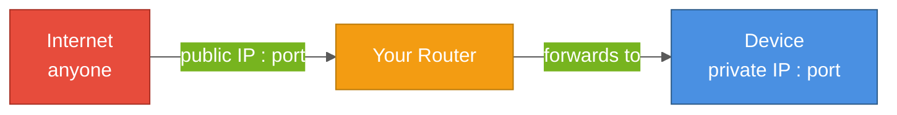
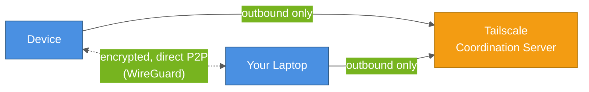
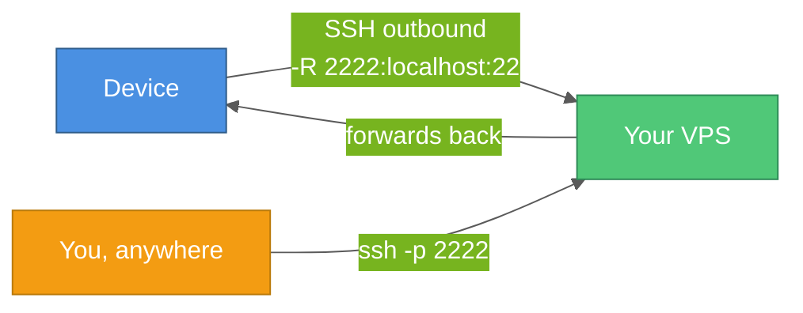
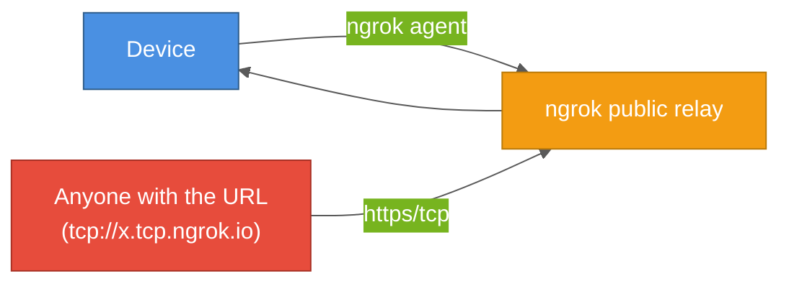
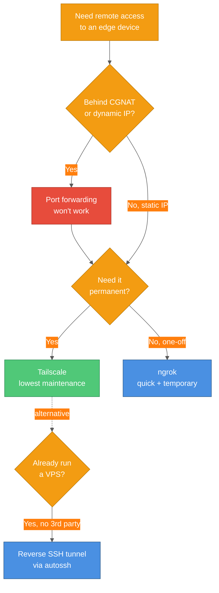

# Secure Remote Access to Edge & Home-Lab Devices

A practical comparison of port forwarding, Tailscale, reverse SSH tunnels, and ngrok for reaching devices like a Jetson Nano, Raspberry Pi, or home server from outside your local network.

## Table of Contents

1. [The Problem in Plain English](#the-problem-in-plain-english)
2. [What's Actually Happening](#whats-actually-happening)
3. [The Options](#the-options)
4. [Decision Table](#decision-table)
5. [Full Examples](#full-examples)
6. [When You Need Which](#when-you-need-which)
7. [Key Takeaways](#key-takeaways)

---

## The Problem in Plain English

You've got a device on your home or lab network — a Jetson Nano, a Raspberry Pi, a NAS — and you want to reach it from outside that network: from a laptop at a coffee shop, from a cloud VM, from your phone. Your device only has a private LAN address (`192.168.x.x`), and the internet can't route to that directly.

You need *something* to bridge the gap. There are four common ways to do it, and picking the wrong one either leaves you exposed to the entire internet or breaks the moment your ISP changes your IP.

## What's Actually Happening

### The Story in Diagrams

#### Port Forwarding



Router must have a real, stable public IP (breaks under CGNAT) - and the door is open to anyone who knocks, not just you.

#### Tailscale (Mesh VPN)



Both ends dial **out** - no inbound port is ever opened, so it works behind CGNAT, hotel wifi, anywhere outbound traffic is allowed.

#### Reverse SSH Tunnel



You control the relay (your own VPS) - no third-party coordination service, but you must already own a publicly-reachable server and keep the tunnel alive yourself.

#### ngrok



Fastest to stand up, zero infrastructure of your own - but free-tier URLs rotate, and anyone holding the URL can reach the endpoint.

Four different trust models, four different failure modes.

## The Options

### 1. Port Forwarding

Configure your router to forward an external port directly to the device's internal IP and port.

```text
Router config:
  External port 2222 → 192.168.1.50:22 (Jetson Nano SSH)
```

**Breaks immediately if:**
- Your ISP uses CGNAT (common on mobile/some residential ISPs) — there's no real public IP on your router to forward from
- Your public IP changes — needs Dynamic DNS (e.g., DuckDNS, No-IP) layered on top just to have a stable name

**Security burden is on you:** every exposed port is scanned by bots within minutes of being opened. You're responsible for hardening (key-only SSH, `fail2ban`, patched software) with no additional layer of defense.

### 2. Tailscale (Mesh VPN)

Install the agent on the device and on whatever you want to access it from; both join the same private mesh network.

```bash
curl -fsSL https://tailscale.com/install.sh | sh
sudo systemctl enable --now tailscaled
sudo tailscale up
tailscale ip -4   # stable 100.x.x.x address, reachable from any device on your tailnet
```

```bash
ssh user@100.x.x.x   # from any machine also on the tailnet
```

No router configuration, no open inbound ports, works through CGNAT because both sides only ever make outbound connections to Tailscale's coordination servers (actual traffic is typically direct peer-to-peer, encrypted via WireGuard).

**Verify:**

```bash
tailscale status   # confirms the device is authenticated and shows peers on the tailnet
```

**Platform notes (e.g. Jetson Nano / older arm64 boards):**

- Older Jetson Nano images sometimes ship an aging Ubuntu 18.04 base without `curl` preinstalled — run `sudo apt update && sudo apt install -y curl` first if the install script fails to fetch.
- `sudo tailscale up` only needs to be run once; the auth token persists across reboots since `tailscaled` is enabled as a systemd service.

### 3. Reverse SSH Tunnel

Requires a publicly-reachable server you control (a cheap VPS works). The device opens an outbound SSH connection to that server and asks it to forward a port back.

```bash
# Run on the Jetson Nano — opens port 2222 on the VPS,
# forwarded back to the Nano's local port 22
ssh -R 2222:localhost:22 you@your-vps.example.com -N
```

```bash
# From anywhere, SSH into the VPS on the forwarded port to reach the Nano
ssh -p 2222 user@your-vps.example.com
```

Keep this alive across reboots/drops with `autossh` or a `systemd` service, rather than a plain foreground `ssh` command:

```bash
autossh -M 0 -N -R 2222:localhost:22 you@your-vps.example.com
```

### 4. ngrok

```bash
ngrok tcp 22
```

Prints a public address like `tcp://0.tcp.ngrok.io:14832` immediately — no router or VPS needed. Good for a demo or one-off debugging session; free-tier addresses are temporary and rotate on restart.

## Decision Table

| | Port Forwarding | Tailscale | Reverse SSH | ngrok |
|---|---|---|---|---|
| Works behind CGNAT | ✗ | ✓ | ✓ | ✓ |
| Open inbound port on your network | ✓ (yes, risk) | ✗ | ✗ | ✗ |
| Needs your own server | ✗ | ✗ | ✓ (a VPS) | ✗ |
| Stable address over time | ✗ (needs DDNS) | ✓ | ✓ (VPS IP) | ✗ (free tier) |
| Setup effort | Medium (router + DDNS) | Low | Medium (VPS + autossh) | Very low |
| Good for permanent access | Not recommended | Yes | Yes | No |
| Good for a quick one-off | No | Overkill | Overkill | Yes |

## Full Examples

**Jetson Nano, permanent access, no VPS available:**

```bash
sudo tailscale up
# from laptop, anywhere:
ssh user@<jetson-tailscale-ip>
```

**Jetson Nano, permanent access, already have a VPS and prefer no third-party dependency:**

```bash
# on the Nano, as a systemd service so it survives reboots
autossh -M 0 -N -R 2222:localhost:22 you@your-vps.example.com
```

**Jetson Nano, showing a running demo to someone for the next hour:**

```bash
ngrok tcp 22
```

## When You Need Which

- **Tailscale** — default choice for personal/permanent remote access to any edge device; works regardless of CGNAT; least ongoing maintenance
- **Reverse SSH** — you already run a VPS and want to avoid depending on a third-party coordination service
- **ngrok** — short-lived access, demos, or debugging sessions where the endpoint doesn't need to be stable
- **Port forwarding** — only when you control a stable public IP, understand the exposure, and have hardened the exposed service; avoid otherwise, especially on CGNAT connections where it won't work at all

## Key Takeaways

### The Mental Model



### Remember

1. **Port forwarding needs a real public IP** — CGNAT (common on mobile/some residential ISPs) breaks it entirely, no workaround short of asking your ISP for a static IP
2. **Tailscale opens zero inbound ports** — both ends only ever dial out, so it works anywhere outbound traffic is allowed
3. **Reverse SSH puts you in control of the relay** — no third-party dependency, but you own keeping the tunnel alive (`autossh`/`systemd`, not a bare foreground `ssh`)
4. **ngrok free tier is for temporary access only** — rotating URLs and no built-in access control make it a poor fit for permanent setups
5. **Every exposed port gets scanned** — if you do port-forward, treat the exposed service as hostile-facing: key-only auth, `fail2ban`, prompt patching

---

## Related

- [Docker Builds Behind Corporate Proxies](./docker-corporate-proxy-build.md) - another case where outbound-only connectivity assumptions break things
