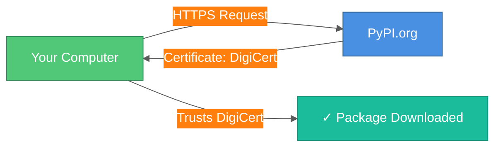
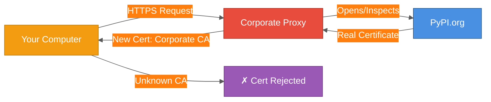
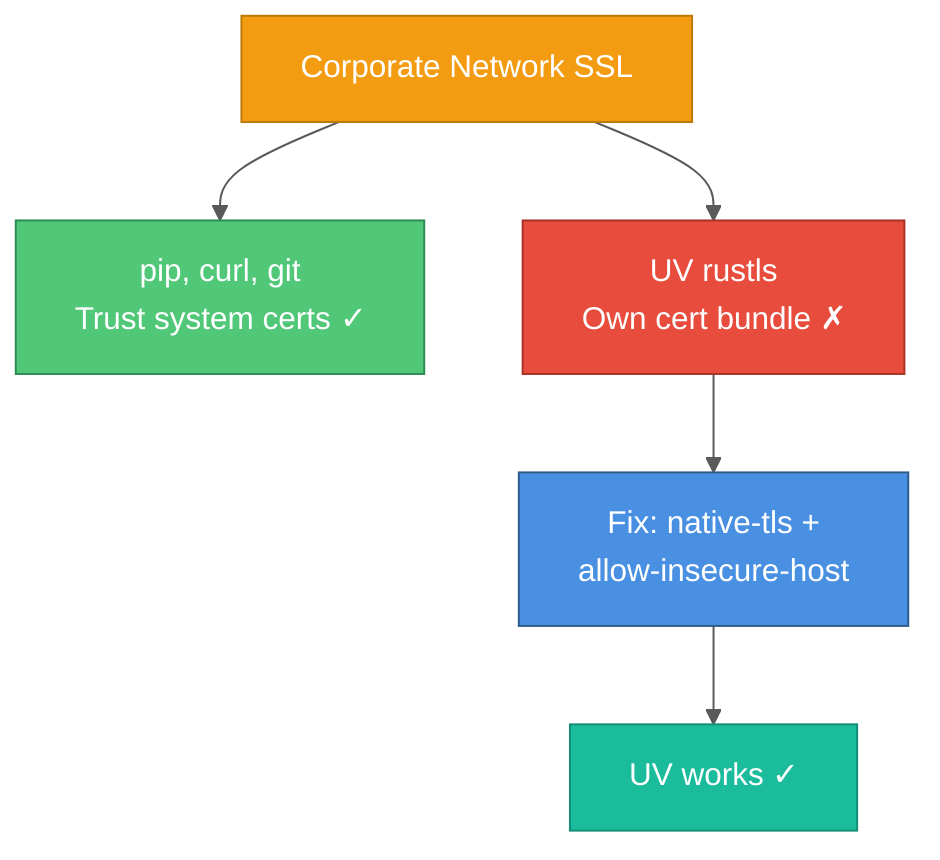

# UV and Corporate Proxies: The SSL Certificate Mystery

A comprehensive guide to fixing UV (modern Python package installer) behind corporate proxies that perform SSL interception.

## Table of Contents

1. [The Problem in Plain English](#the-problem-in-plain-english)
2. [What's Actually Happening](#whats-actually-happening)
3. [Why UV Behaves Differently](#why-uv-behaves-differently)
4. [The Solution](#the-solution)
5. [Setup Scripts](#setup-scripts)
6. [When You Need This](#when-you-need-this)

---

## The Problem in Plain English

**You see this error:**

```text
× Failed to download `httpcore==1.0.9`
  ╰─▶ invalid peer certificate: UnknownIssuer
```

**What you expected:**
UV downloads Python packages from PyPI (Python Package Index) just like pip does.

**What happened instead:**
UV refuses to download anything, claiming the security certificate is invalid.

**The weird part:**
Other tools (pip, curl, git) work fine on the same network. Only UV fails.

---

## What's Actually Happening

### The Story in Analogies

Imagine you're sending a letter:

#### Normal Internet (Home/Coffee Shop)

```text
You → Post Office (PyPI) → You get package
      ✓ Letter sealed by Post Office
      ✓ You trust Post Office's seal
```

#### Corporate Network with Proxy

```text
You → Security Guard → Post Office → Security Guard → You
      ↑                                  ↑
      Opens letter                      Reseals letter
      (checks content)                  (with company seal)
```

**The Security Guard (Corporate Proxy) does this for safety:**

- Opens every letter/package (SSL interception)
- Checks it's not malicious
- Reseals it with the company's seal
- Sends it to you

**The Problem:**

- Your computer expects the **Post Office seal** (PyPI's certificate)
- But receives the **Company seal** (Proxy's certificate)
- UV says: "Hey, this isn't from PyPI! Someone tampered with this!"
- UV refuses to accept it (security by design)

### The Technical Version

**Normal SSL/TLS flow:**



**Corporate network with SSL interception:**



**What the proxy does:**

1. **Intercepts** your HTTPS connection to PyPI
2. **Decrypts** the traffic (authorized MITM for security inspection)
3. **Inspects** the content for security threats
4. **Re-encrypts** with the corporate CA certificate
5. **Sends** it to you

**Why this normally works:**

- IT has installed the corporate CA certificate on your machine
- Most tools (pip, curl, browsers) trust certificates in your system keychain
- So they accept the proxy's re-signed certificate

**Why UV fails:**

- UV uses **Rust's TLS implementation** (rustls)
- Rustls **doesn't** use the system certificate store by default
- Rustls has its own **hardcoded list** of trusted CAs
- The corporate CA isn't in that list
- UV rejects the connection

---

## Why UV Behaves Differently

### Comparison: UV vs Pip

| Tool | TLS Implementation | Certificate Store | Result |
|------|-------------------|-------------------|--------|
| **pip** | Python's `ssl` module | Uses system certificates | ✓ Works with proxy |
| **curl** | OpenSSL/LibreSSL | Uses system certificates | ✓ Works with proxy |
| **git** | OpenSSL | Uses system certificates | ✓ Works with proxy |
| **UV** | Rustls (Rust) | Own certificate bundle | ✗ Rejects proxy cert |

### Why UV Uses Rustls

**Design choice by the UV team:**

- **Security**: Rust's memory safety prevents certificate validation bugs
- **Performance**: Compiled Rust is faster than Python's SSL
- **Portability**: Same behavior on all platforms
- **Independence**: No dependency on system OpenSSL

**The trade-off:**

- ✓ More secure and portable
- ✗ Doesn't automatically trust corporate CAs

---

## The Solution

### Option 1: Tell UV to Trust Insecure Hosts (Recommended for Corporate)

**Create `~/.config/uv/uv.toml`:**

```toml
# Use macOS native TLS (which respects system certificates)
native-tls = true

# Load certificates from system keychain
system-certs = true

# Allow "insecure" connections to PyPI
# (They're not actually insecure - just resealed by corporate proxy)
allow-insecure-host = ["pypi.org", "files.pythonhosted.org"]
```

**What this does:**

1. `native-tls = true`: Uses macOS Security framework instead of rustls
2. `system-certs = true`: Loads certificates from macOS keychain
3. `allow-insecure-host`: Skips certificate validation for PyPI domains

**Is this safe?**

- ✓ Yes, within the corporate network
- ✓ The proxy is authorized by your company
- ✓ Better than disabling SSL completely
- ✗ Don't use this configuration outside corporate network

### Option 2: Add Corporate CA to UV's Trust Store (More Secure)

This would be ideal, but UV doesn't currently support adding custom CAs to rustls easily. Option 1 is the practical solution.

---

## Setup Scripts

### Automated Setup Script

Save as `setup_uv_corporate_proxy.sh`:

```bash
#!/bin/bash
# UV Setup Script for Corporate Network
# Works with any corporate proxy that performs SSL interception

set -e

# Color codes
GREEN='\033[0;32m'
YELLOW='\033[1;33m'
NC='\033[0m'

echo -e "${GREEN}==> Configuring UV for corporate proxy...${NC}"

# Create UV config directory
mkdir -p ~/.config/uv

# Backup existing config
if [ -f ~/.config/uv/uv.toml ]; then
    BACKUP_FILE=~/.config/uv/uv.toml.backup.$(date +%Y%m%d_%H%M%S)
    cp ~/.config/uv/uv.toml "$BACKUP_FILE"
    echo -e "${YELLOW}⚠ Backed up existing config to: $BACKUP_FILE${NC}"
fi

# Create configuration
cat > ~/.config/uv/uv.toml << 'EOF'
# UV Configuration for Corporate Network
# Allows UV to work behind corporate proxy with SSL interception

# Use native TLS implementation (macOS Security framework)
native-tls = true

# Load certificates from system certificate store
system-certs = true

# Allow insecure connections to PyPI (necessary for corporate proxy)
# The proxy intercepts SSL traffic with its own certificate
allow-insecure-host = ["pypi.org", "files.pythonhosted.org"]
EOF

echo "✓ Created ~/.config/uv/uv.toml"
echo ""

# Verify
echo "==> Testing configuration..."
if uv pip install httpx --dry-run > /dev/null 2>&1; then
    echo -e "${GREEN}✓ Configuration verified! UV can download packages.${NC}"
else
    echo -e "${YELLOW}✗ Configuration test failed. Check proxy settings.${NC}"
    exit 1
fi

echo ""
echo -e "${GREEN}==> Setup complete!${NC}"
echo "This configuration applies to all UV operations on this machine."
echo ""
echo "Environment variables needed (if not already set):"
echo "  export HTTP_PROXY=http://your-corporate-proxy:8080"
echo "  export HTTPS_PROXY=http://your-corporate-proxy:8080"
```

### Make it executable and run:

```bash
chmod +x setup_uv_corporate_proxy.sh
./setup_uv_corporate_proxy.sh
```

---

## When You Need This

### ✅ Situations where this applies

- **New laptop setup** at work
- **MCP servers** failing to start in VS Code
- **CI/CD runners** behind corporate proxy
- **Colleague's machine** with same error
- **Docker containers** building behind proxy
- **Any tool using UV** (uv, ruff, etc.)

### ✅ One-time setup

- Configuration is **global** (`~/.config/uv/uv.toml`)
- Works for **all projects** automatically
- **No per-project** setup needed
- **New repositories** work immediately

### ⚠️ When NOT to use this

- **Outside corporate network** (home, coffee shop, cloud VMs)
- **Public CI/CD** (GitHub Actions, GitLab CI)
- **Production servers** (unless behind corporate proxy)

---

## Troubleshooting

### Still getting SSL errors?

**1. Check proxy environment variables:**

```bash
echo $HTTP_PROXY
echo $HTTPS_PROXY
```

Should be set to your corporate proxy (e.g., `http://corporate-proxy.example.com:8080`)

**2. Verify UV version:**

```bash
uv --version
```

Need UV 0.11.0 or later for `allow-insecure-host` support.

**3. Test without UV:**

```bash
curl -I https://pypi.org
```

If this fails, the problem is network/proxy, not UV.

**4. Check if native-tls is working:**

```bash
uv pip install httpx --dry-run -v
```

Look for "native-tls" in verbose output.

### MCP Server still failing in VS Code?

**Check `.vscode/mcp.json` has proxy settings:**

```json
{
  "servers": {
    "your-server": {
      "command": "uv",
      "args": ["run", "server.py"],
      "env": {
        "HTTP_PROXY": "http://corporate-proxy.example.com:8080",
        "HTTPS_PROXY": "http://corporate-proxy.example.com:8080"
      }
    }
  }
}
```

**Restart VS Code completely** after configuring UV.

---

## Key Takeaways

### The Mental Model



### Remember

1. **Corporate proxies rewrite SSL certificates** - this is normal and authorized
2. **UV uses different TLS library** - doesn't trust system certificates by default
3. **Configuration is global** - set once, works everywhere
4. **Not a security risk** - you're trusting your company's authorized infrastructure
5. **Share the script** - helps colleagues avoid the same frustration

---

## Related

- [Enterprise Python Setup](./enterprise-python-setup.md) - Comprehensive corporate Python guide
- [Modern Python Tooling](../shared/modern-python-tooling.md) - Ruff, Mypy, Pre-commit
- [UV Documentation](https://docs.astral.sh/uv/) - Official UV docs
