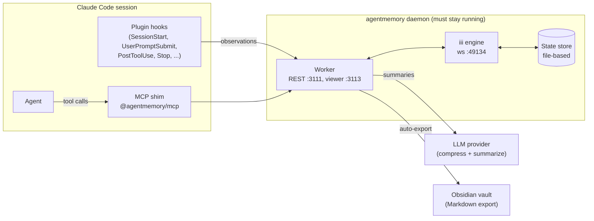
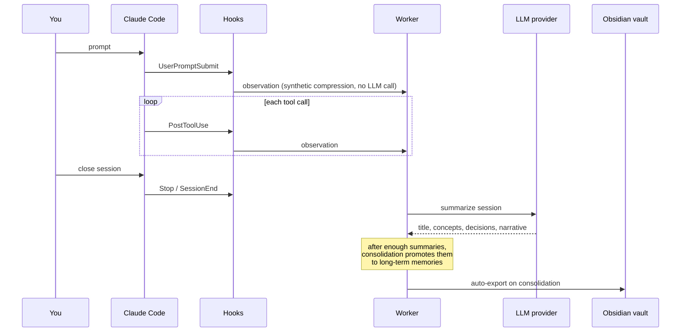
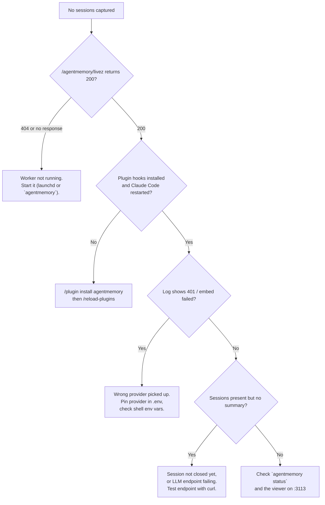

# Persistent Agent Memory with agentmemory (Claude Code + Azure Foundry + Obsidian)

## Problem

Coding agents forget everything between sessions. Built-in memory (for Claude Code:
`CLAUDE.md` and per-project memory files) works like sticky notes: small, manually
curated, and only as good as what the agent remembered to write down.

[agentmemory](https://github.com/rohitg00/agentmemory) is a local server that sits
behind the agent and records what happens during sessions (prompts, tool calls),
summarizes each session, and makes it searchable and re-injectable later. This guide
covers what it is, whether it is worth running, how to wire it up, and the failure modes
that are easy to hit because it is split across several cooperating processes.

## Is it useful?

It depends on what you already have. Honest assessment after setting it up:

| Situation | Verdict |
|---|---|
| You only use one agent and are happy with `CLAUDE.md` + built-in memory | Marginal. You would be duplicating what already exists. |
| You want automatic capture (no "remember this" step) and per-session summaries | Useful. This is the main value. |
| You use several agents/tools and want one searchable store | Useful. It is agent-agnostic (MCP + REST + hooks). |
| You want a browsable knowledge base (Obsidian vault) of past work | Useful, via the Markdown export. |
| You want long-term "memories" or lessons from day one | Not immediately. Consolidation needs several session summaries first. |

Two things to know up front:

- **MCP alone captures nothing.** Installing only the MCP server gives you tools the
  agent can call (`memory_save`, `memory_recall`, ...). Nothing is recorded unless the
  agent chooses to call them. Automatic capture comes from the **plugin hooks**.
- **It is only useful if it is running.** The MCP shim is launched by the agent per
  session, but the server it talks to is a separate long-lived daemon you must keep alive.

## Architecture



Key point: the **worker** (REST API and logic) and the **engine** (storage and function
runtime) are separate processes. The engine can be alive while the worker is dead, which
produces a confusing half-working state (see Troubleshooting).

## Capture lifecycle



## Setup

### 1. Run the daemon

Install it globally so paths are stable (the `npx` cache can be cleared at any time):

```bash
npm install -g @agentmemory/agentmemory
agentmemory          # starts worker + engine; first run writes ~/.agentmemory/.env
curl http://localhost:3111/agentmemory/livez   # expect {"status":"ok",...}
```

### 2. Install the Claude Code plugin (hooks + skills)

Inside Claude Code:

```
/plugin marketplace add rohitg00/agentmemory
/plugin install agentmemory@agentmemory
/reload-plugins
```

The plugin registers the capture hooks, the skills (`recall`, `remember`, `handoff`,
`forget`, ...), and its own MCP server entry. If you had wired the MCP server by hand in
`~/.claude.json`, that entry becomes a duplicate and can be removed.

### 3. Configure `~/.agentmemory/.env`

Restrict the file first, since it will hold an API key:

```bash
chmod 600 ~/.agentmemory/.env
```

Recommended settings:

```bash
# LLM used for summaries (any Anthropic-compatible endpoint)
ANTHROPIC_API_KEY=<your key>
ANTHROPIC_BASE_URL=https://<resource>.services.ai.azure.com/anthropic   # Azure AI Foundry
ANTHROPIC_MODEL=<deployment name, e.g. claude-haiku-4-5>

# Do not let a stray shell variable pick the provider (see Lessons learned)
OPENAI_API_KEY_FOR_LLM=false
EMBEDDING_PROVIDER=local          # free on-device embeddings, no key needed

# Features worth enabling
CONSOLIDATION_ENABLED=true        # summaries -> long-term memories
SNAPSHOT_ENABLED=true             # hourly backups
GRAPH_EXTRACTION_ENABLED=true     # concept graph (extra LLM calls)
AGENTMEMORY_REFLECT=true          # periodic lesson synthesis
OBSIDIAN_AUTO_EXPORT=true         # Markdown vault after consolidation
```

### 4. Verify the Foundry endpoint before trusting it

Test the endpoint directly so a failure is attributable to the endpoint, not agentmemory:

```bash
curl -s "https://<resource>.services.ai.azure.com/anthropic/v1/messages" \
  -H "content-type: application/json" \
  -H "anthropic-version: 2023-06-01" \
  -H "x-api-key: $KEY" \
  -d '{"model":"<deployment>","max_tokens":16,"messages":[{"role":"user","content":"say ok"}]}'
```

A 200 with a normal reply means `ANTHROPIC_BASE_URL` + `x-api-key` will work, because
agentmemory's Anthropic provider uses exactly that header. The `model` value is the
**deployment name** on your resource.

### 5. Run it at login (macOS LaunchAgent)

`~/Library/LaunchAgents/com.example.agentmemory.plist`:

```xml
<?xml version="1.0" encoding="UTF-8"?>
<!DOCTYPE plist PUBLIC "-//Apple//DTD PLIST 1.0//EN" "http://www.apple.com/DTDs/PropertyList-1.0.dtd">
<plist version="1.0">
<dict>
  <key>Label</key><string>com.example.agentmemory</string>
  <key>ProgramArguments</key>
  <array>
    <string>/opt/homebrew/bin/node</string>
    <string>/opt/homebrew/bin/agentmemory</string>
  </array>
  <key>EnvironmentVariables</key>
  <dict>
    <key>PATH</key><string>/opt/homebrew/bin:/usr/local/bin:/usr/bin:/bin</string>
  </dict>
  <key>RunAtLoad</key><true/>
  <key>KeepAlive</key><true/>
  <key>ThrottleInterval</key><integer>30</integer>
  <key>StandardOutPath</key><string>/Users/YOU/Library/Logs/agentmemory/agentmemory.log</string>
  <key>StandardErrorPath</key><string>/Users/YOU/Library/Logs/agentmemory/agentmemory.err.log</string>
</dict>
</plist>
```

```bash
mkdir -p ~/Library/Logs/agentmemory
agentmemory stop                       # stop any manually started engine first
launchctl bootstrap gui/$(id -u) ~/Library/LaunchAgents/com.example.agentmemory.plist
launchctl print gui/$(id -u)/com.example.agentmemory | grep -E "state|pid"
```

Test the supervision by killing the worker PID: it should return within the throttle
interval. To remove: `launchctl bootout gui/$(id -u)/com.example.agentmemory` and delete
the plist.

### 6. Obsidian vault

```bash
brew install --cask obsidian
```

The export writes to `~/.agentmemory/vault` by default. agentmemory refuses export paths
outside its export root, so to keep the vault elsewhere (for example a synced folder)
**symlink** the default path to the target instead of changing the root:

```bash
mv ~/.agentmemory/vault ~/.agentmemory/vault.old
ln -s "/path/to/your/Obsidian/AgentMemory" ~/.agentmemory/vault
```

Then open the target folder as a vault in Obsidian. Notes are written on consolidation
(or on demand via `POST /agentmemory/obsidian/export` with an explicit `vaultDir`).

## Configuration cheat sheet

| Setting | Worth it? | Cost / trade-off |
|---|---|---|
| `CONSOLIDATION_ENABLED` | Yes | Occasional LLM calls. Needed for long-term memories (starts after about 5 summaries). |
| `SNAPSHOT_ENABLED` | Yes | Small disk use. Cheap insurance. |
| `GRAPH_EXTRACTION_ENABLED` | Optional | One LLM call per memory. Least proven benefit. |
| `AGENTMEMORY_REFLECT` | Optional | Only useful after consolidation has produced data. |
| `OBSIDIAN_AUTO_EXPORT` | If you use Obsidian | None beyond disk. |
| `AGENTMEMORY_AUTO_COMPRESS` | Usually no | LLM call on every observation; largest cost. Default synthetic compression is fine. |
| `AGENTMEMORY_SECRET` | Only if shared/exposed | REST is open on loopback by default. If set, hooks and MCP need it too. |
| `AGENTMEMORY_TOOLS=core` | No | Drops delete, audit, and export tools, which breaks the `forget` skill. |
| `CLAUDE_MEMORY_BRIDGE` | No | Mirrors into CLAUDE.md and overlaps with built-in memory. |
| `AGENTMEMORY_ALLOW_AGENT_SDK` | No | Can cause hook recursion. |

## Lessons learned

1. **MCP is not capture.** Without the plugin hooks, sessions and audit logs stay empty
   no matter how many tools are exposed. Check `memory_sessions` after a real session.
2. **A listening port does not mean a working server.** The engine kept port 3111 open
   after the worker died. Every REST path returned 404 and hooks failed silently.
   `agentmemory status` showing `Uptime: 0s` and `Health: unknown` was the tell.
3. **Shell environment variables leak into provider detection.** A stale
   `OPENAI_API_KEY` exported in a shell rc file was auto-selected as the LLM and
   embedding provider, so every embed and summary returned 401. `agentmemory doctor` said
   "no key set" because it only reads `.env`, which made the diagnosis misleading. Pin the
   provider explicitly (`OPENAI_API_KEY_FOR_LLM=false`, `EMBEDDING_PROVIDER=local`) and
   run the daemon under launchd, which does not inherit your shell environment.
4. **Check the logs for `embed failed` and `Summarize failed`.** Raw capture keeps
   working while embeddings and summaries fail, so the failure is easy to miss.
5. **Install globally before collecting data.** The first run via `npx` stored data in a
   path relative to the engine's working directory. Switching to the global install
   moved the store to a different location, and the earlier data could not be found or
   migrated. Choose the final install method first, then start accumulating memory.
6. **Secrets file permissions.** The generated `.env` was world-readable. Run
   `chmod 600` before adding a key.
7. **Do not trade tools for tidiness.** `core` mode hides 46 tools, including the ones
   that implement deletion and auditing.
8. **Summaries are LLM output, not records.** They can misname config keys or variables.
   Treat them as pointers and keep the underlying observations as the source of truth.
9. **Privacy.** Hooks record tool inputs and outputs, so file contents and commands from
   every project land in the store, and in a synced Obsidian vault if you export to one.
   Use the `forget` skill or the governance delete tool to remove sensitive material.
10. **Synced vault caveat.** A vault inside a cloud-sync folder breaks the export if the
    sync client is not mounted, and Obsidian's `.obsidian` settings can conflict across
    machines.

## Troubleshooting



Useful commands:

```bash
agentmemory status            # health, counts, uptime
agentmemory stop              # stop the engine started by the CLI
tail -f ~/Library/Logs/agentmemory/agentmemory.log
```

## References

- [agentmemory repository](https://github.com/rohitg00/agentmemory)
- [Model Context Protocol](model-context-protocol.md) - how MCP tool servers fit into agents
- [Obsidian](https://obsidian.md/)
