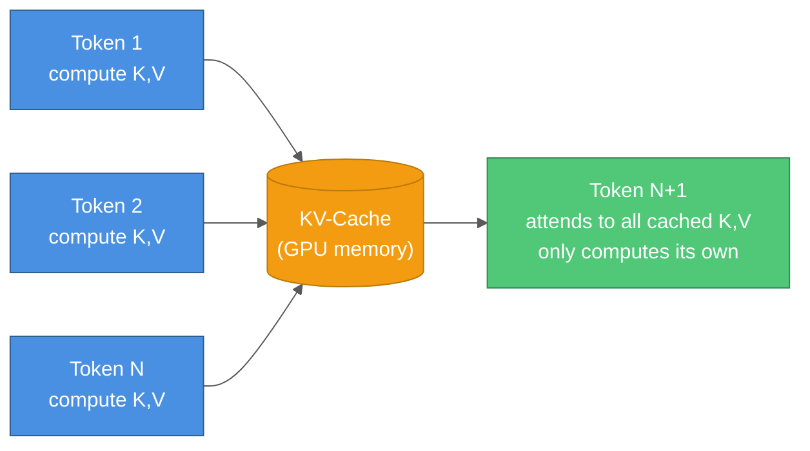
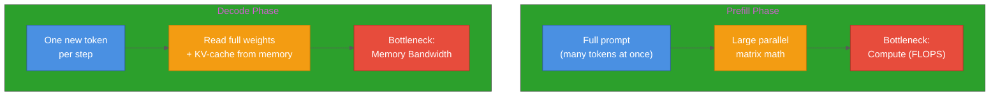
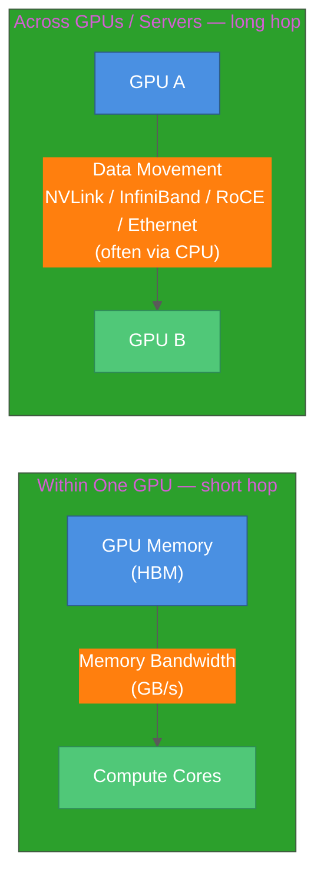
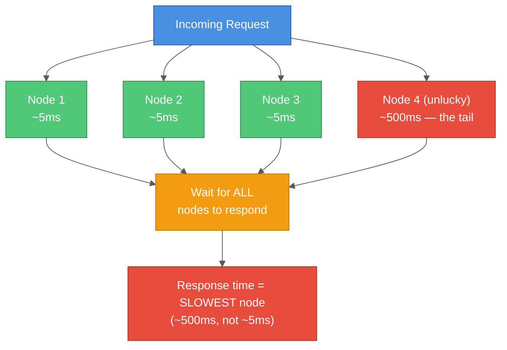

# LLM Inference Fundamentals: KV-Cache, Tail Latency, and Disaggregated Serving

A guide to the systems-level concepts that determine why LLM inference gets harder to serve efficiently as you scale — from a single request to a production fleet.

## Table of Contents

1. [Introduction](#introduction)
2. [Autoregressive Decoding and the KV-Cache](#autoregressive-decoding-and-the-kv-cache)
3. [Prefill vs. Decode: Two Workloads in One](#prefill-vs-decode-two-workloads-in-one)
4. [Memory Bandwidth vs. Data Movement](#memory-bandwidth-vs-data-movement)
5. [Tail Latency at Scale](#tail-latency-at-scale)
6. [Disaggregated Serving](#disaggregated-serving)
7. [Summary](#summary)
8. [Further Reading](#further-reading)

---

## Introduction

Most explanations of LLM serving stop at "it runs on a GPU." In production, the bottleneck that limits throughput and latency keeps *moving* as you scale:

```
Single request  →  bottleneck: raw compute
Many requests   →  bottleneck: memory bandwidth (feeding the GPU's own cores)
Many GPUs/nodes →  bottleneck: data movement (feeding data between GPUs/servers)
```

Each of these is a distinct, well-studied problem with its own fix. This guide walks through them in order.

---

## Autoregressive Decoding and the KV-Cache

A transformer generates output one token at a time. To predict the next token, each new token uses **attention** to look back at every previous token in the sequence. Doing that requires a **Key (K)** and **Value (V)** vector for every token, at every attention layer.

**The naive problem:** a token's K/V vectors never change once computed — they depend only on that token and the layers before it. But without caching, a naive implementation recomputes K/V for *every previous token* at *every new generation step*, redoing identical work over and over.

**The fix — KV-cache:** compute each token's K/V vectors once, store them in GPU memory, and reuse them on every subsequent step. Only the newest token's K/V needs computing each step.



**Why it becomes a bottleneck, not just an optimization:** the KV-cache has to stay in GPU memory for the entire duration of a request, and it grows with sequence length, model size, and concurrent request count. Naive allocators that reserve a fixed, contiguous block per request (sized for the worst case) waste **60-80%** of that memory to fragmentation and over-reservation.

**PagedAttention** (used in vLLM) fixes this the way an OS handles virtual memory — splitting the cache into small, non-contiguous pages allocated on demand, and shareable across requests doing parallel sampling from the same prompt. Reported results: memory waste drops to under 4%, and throughput improves up to **24x** over naive HuggingFace serving, because more requests can be batched into the same GPU memory footprint.

---

## Prefill vs. Decode: Two Workloads in One

LLM inference is really two phases with opposite resource profiles:

| Phase | What it does | Bottleneck |
|---|---|---|
| **Prefill** | Reads the full input prompt, computes KV-cache for all of it at once | **Compute-bound** — large parallel matrix math across many tokens at once |
| **Decode** | Generates one output token at a time, reading the KV-cache built so far | **Memory-bandwidth-bound** — small amount of math per token, but a large amount of data (weights + KV-cache) must be read from memory each step |



Running both phases on the same GPU, interleaved as requests arrive, creates interference: a burst of new prompts (prefill) competes for the same silicon as in-flight token generation for other users (decode), stalling one or the other.

---

## Memory Bandwidth vs. Data Movement

These two terms both describe "waiting on data," but they refer to different physical hardware and different distances:

- **Memory bandwidth** is the speed limit on the short trip from a GPU's own memory (HBM, physically stacked next to its compute cores) to the compute cores themselves. Modern GPUs can perform far more math per second (FLOPS) than they can move data per second from their own memory — a gap sometimes called the **memory wall**. Decode is memory-bandwidth-bound because it moves a large amount of data (full model weights, full KV-cache) to do a comparatively small amount of math per token.
- **Data movement** (in the broader sense) is the speed limit on the much longer trip *between separate GPUs, servers, or devices* — over NVLink, InfiniBand, RoCE, or standard Ethernet. This hop is orders of magnitude farther than the HBM-to-core hop, often has a CPU sitting in the path copying between buffers, and only becomes relevant once a workload spans more than one chip (multi-GPU serving, disaggregated pools, or edge devices talking to a server).



Fixing one does not fix the other — they are different bottlenecks on different hardware, and each becomes visible only after the previous one is resolved:

```
Fix raw compute        → GPU sits idle waiting on its OWN memory (memory bandwidth)
Fix memory bandwidth   → GPU sits idle waiting on ANOTHER GPU/server (data movement)
```

---

## Tail Latency at Scale

Latency isn't one number — it's a distribution. Reporting only the **average** hides what the slowest requests experience. This is usually measured in percentiles:

- **P50** (median): half of requests finish faster than this
- **P99 / P99.9**: 99% / 99.9% of requests finish faster than this — the "tail"

**Why the tail matters more than it seems:** a user making many requests over time will eventually hit the tail, even if it's rare per-request. Production SLAs are typically written in tail terms ("99.9% under 200ms"), not averages, because that's what actually captures user-facing pain.

**Why it gets worse at scale, not better ("the tail at scale"):** if a single request has to fan out to *N* other services or nodes in parallel and wait for all of them before continuing, the chance that *at least one* of those N calls lands in the slow tail compounds with N. Adding more parallel dependencies degrades overall P99 even if no individual component got any slower — you've added more chances for one unlucky component to stall the whole request. This is the same reason distributed, synchronous LLM serving (e.g. tensor parallelism, disaggregated pools) is more sensitive to tail latency than a single-node deployment.



---

## Disaggregated Serving

Since prefill and decode have opposite resource profiles (see above), and colocating them causes interference, **disaggregated serving** splits them onto **separate, purpose-built pools of hardware**:


- **Prefill pool**: dedicated to compute-heavy prompt processing, uninterrupted by decode traffic.
- **Decode pool**: dedicated to steady, memory-bound token generation; since it's not compute-bound, it can run on cheaper, memory-optimized hardware instead of the most expensive GPUs.

Microsoft's **Splitwise** research reports **up to 2.35x more throughput at the same cost/power budget** (or 1.4x throughput at 20% lower cost) from this split alone — no model changes required.

**The catch:** disaggregation only works if the KV-cache transfer *between* the two pools is fast enough not to become the new bottleneck — this is data movement (see above), not memory bandwidth. **NVIDIA Dynamo** productionizes this with **NIXL**, a communication library that moves KV-cache data across NVLink, InfiniBand, RoCE, or Ethernet without CPU-mediated staging, unifying all of them under one abstraction. Reported results: up to **30x throughput** on DeepSeek-R1 (671B parameters) on GB200 NVL72 versus non-disaggregated serving, and **2x+** for Llama 70B on Hopper GPUs.

---

## Summary

**Key Takeaways:**

1. **KV-cache** avoids recomputing attention state for tokens already processed — essential for speed, but a major source of GPU memory pressure at scale.
2. **Prefill (compute-bound) and decode (memory-bandwidth-bound)** are two different workloads glued into one request — colocating them on the same hardware wastes one resource or the other.
3. **Memory bandwidth** (GPU-to-own-memory) and **data movement** (GPU/server-to-GPU/server) are different bottlenecks on different hardware — fixing one does not fix the other.
4. **Tail latency** compounds with parallel dependencies — more nodes in a synchronous request path means a worse P99, even with no individual component getting slower.
5. **Disaggregated serving** splits prefill and decode onto separate, right-sized hardware pools, but shifts the bottleneck to the network link between them — which is why fast, CPU-bypassing interconnect libraries (e.g. NIXL) have become a first-class part of production inference stacks.

---

## Further Reading

- [vLLM: Easy, Fast, and Cheap LLM Serving with PagedAttention](https://vllm.ai/blog/2023-06-20-vllm) — the original PagedAttention/KV-cache paging approach
- [Splitwise: Efficient Generative LLM Inference Using Phase Splitting](https://www.microsoft.com/en-us/research/publication/splitwise-efficient-generative-llm-inference-using-phase-splitting/) — Microsoft Research, phase-splitting prefill/decode
- [Introducing NVIDIA Dynamo](https://developer.nvidia.com/blog/introducing-nvidia-dynamo-a-low-latency-distributed-inference-framework-for-scaling-reasoning-ai-models/) — disaggregated serving and NIXL in production
- [The Tail at Scale](https://research.google/pubs/the-tail-at-scale/) — Dean & Barroso, Communications of the ACM, 2013
- [Kubernetes Dynamic Resource Allocation (DRA)](https://kubernetes.io/docs/concepts/scheduling-eviction/dynamic-resource-allocation/) — attribute-based device scheduling for GPUs, successor to the device plugin model

---

**Created:** 2026-08-18
**Tags:** #llm-inference #kv-cache #tail-latency #disaggregated-serving #memory-bandwidth #genai #ml-systems
