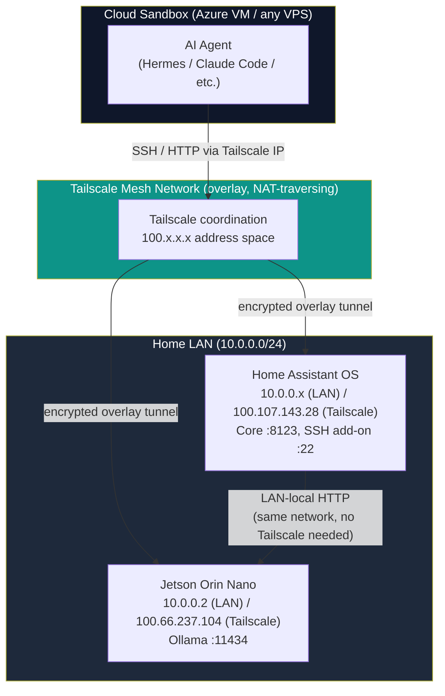
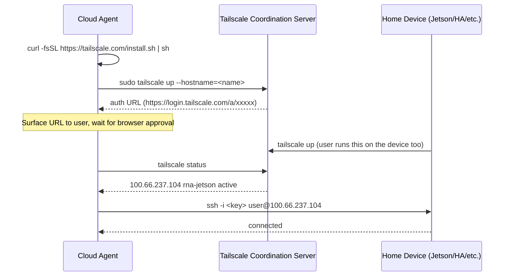
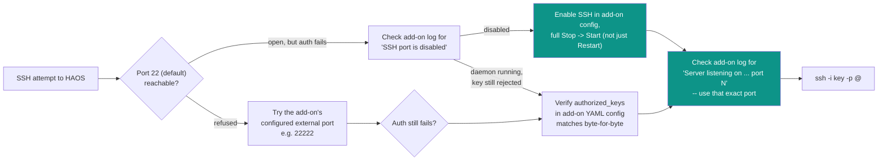
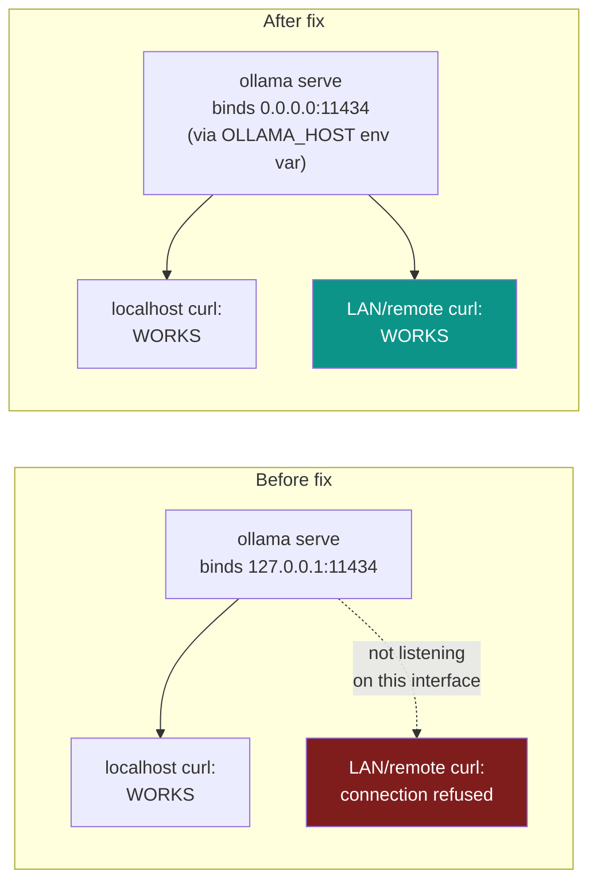
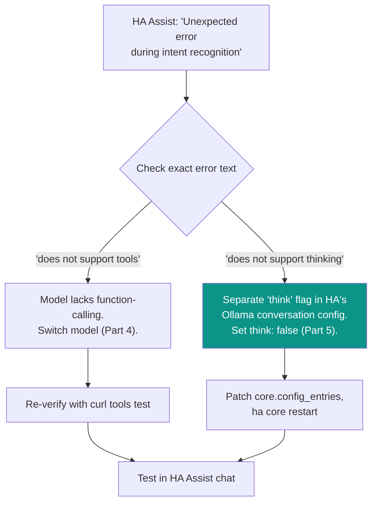

# Bridging a Home LAN to a Cloud Agent Sandbox: Ollama + Home Assistant on a Jetson

## Why this exists

A cloud-hosted AI agent (running in a VPS/container/sandbox) cannot reach devices on
your home LAN by default — private IPs like `192.168.x.x` or `10.0.0.x` simply aren't
routable from the public internet. This guide walks through a real debugging session
that bridged a cloud agent to a home Jetson Orin Nano (running Ollama) and a Home
Assistant OS instance, using Tailscale as the mesh network, and documents every real
pitfall hit along the way — SSH auth failures that looked like network failures,
a bind-address gotcha in Ollama, and a subtle Home Assistant config flag that had
nothing to do with the model itself.

None of this is Jetson-specific or Home-Assistant-specific in principle — the same
pattern applies to any "cloud agent needs to reach a home-network appliance" scenario
(a NAS, a Raspberry Pi, a self-hosted service).

## Architecture overview



**Key insight:** the cloud agent always reaches home devices via their Tailscale
(`100.x.x.x`) address — never the LAN address. But two devices that are *already on
the same home LAN* (like Home Assistant and the Jetson here) can talk to each other
over the plain local IP; they don't need Tailscale between themselves at all, since
Tailscale is solving the "how does the cloud agent get in" problem, not a
device-to-device problem.

## Part 1 — Reaching a home device from a cloud sandbox (Tailscale)

### The core problem

A private IP the user gives you (`10.0.0.2`, `192.168.1.50`) is not reachable from a
cloud sandbox — you'll get `No route to host` or a timeout on the first attempt. This
is expected, not a misconfiguration.

### The fix



Once both sides are authenticated to the same tailnet, `tailscale status` lists every
device with its overlay IP — that's the address to use for everything going forward,
not the original LAN IP.

### Pitfall: "port unreachable" vs. "auth rejected" look identical at first glance

A generic SSH `Permission denied` error can come from two completely different root
causes, and it's easy to misdiagnose one as the other:

1. **Real network unreachability** — port closed, firewalled, or the device is offline.
2. **Real auth rejection** — the port is open, the SSH daemon is running and responding,
   but the offered key isn't authorized.

**Diagnose which one you're facing before touching any keys:**

```bash
# Does the transport even work? (independent of any SSH auth)
tailscale ping --timeout=5s <device-hostname>
timeout 8 bash -c "cat < /dev/null > /dev/tcp/<tailscale-ip>/22" && echo OPEN || echo CLOSED
nc -zv -w 5 <tailscale-ip> 22

# If OPEN: it's an auth problem, not a network problem. Get the exact rejection reason:
ssh -i <key> -o ConnectTimeout=10 -v <user>@<host> "echo ok" 2>&1 | grep -iE "identity file|offering|denied|no more auth"
```

If the TCP port test succeeds but SSH still fails, the verbose output tells you exactly
what happened: `Offering public key: ... SHA256:<fingerprint>` followed immediately by
`Authentications that can continue: publickey,password` means the server saw the key
and rejected it — not a network issue, not a wrong port, just a key not in
`authorized_keys` (or the wrong username).

### Pitfall: rebooting a device makes it briefly disappear from Tailscale, then it's an auth issue again

After a reboot, `tailscale status` will show `offline, last seen Xs ago` for a short
window while the device's network stack and `tailscaled` daemon come back up (typically
30s-2min, hardware dependent). Don't immediately retry SSH during this window and
conclude something is broken — wait for `tailscale status` to show `active` (ideally
`active; direct <ip>:<port>` rather than `active; relay "..."`, which indicates a
direct P2P connection was established, lower latency) before retrying.

### Pitfall: wrong username assumption

If the cloud sandbox's own local account name (e.g. `azureuser` on an Azure VM) doesn't
match any account on the target device, every key attempt fails with a clean auth
rejection regardless of whether the key itself is correctly authorized. SSH defaults to
using the *client's own username* unless told otherwise — always confirm the actual
account name the user logs in as on the target device rather than assuming it matches
the agent's own hostname/username.

```bash
# Wrong (defaults to this VM's own username):
ssh -i <key> <tailscale-ip>

# Right (explicit target username, confirmed with the device owner):
ssh -i <key> <actual-username>@<tailscale-ip>
```

## Part 2 — Home Assistant OS: a second, different SSH surface

Home Assistant OS (HAOS) does not expose a plain OpenSSH daemon on port 22 by default —
that's reserved for the "Advanced SSH & Web Terminal" **add-on**, which:

- Runs its own **Dropbear** SSH server (not OpenSSH) — identifiable by its banner:
  `SSH-2.0-dropbear_2026.91`.
- Has its own **separate `authorized_keys` config**, edited through the add-on's own
  configuration UI (a YAML block), not a file you can directly append to over SSH the
  normal way until you're already in.
- Has a config flag that can leave the SSH *daemon itself disabled* even while the
  add-on process and its underlying port mapping mechanics look otherwise fine — check
  the add-on's own log output for a line like:
  ```
  WARNING: SSH port is disabled. Prevent start of SSH server.
  ```
  vs., once fixed:
  ```
  INFO: Starting the SSH daemon...
  Server listening on 0.0.0.0 port 22.
  ```
- The add-on's **external port mapping can differ from the container-internal port**
  the daemon actually binds (e.g. daemon listens on container-internal port 22, but the
  add-on's Network tab maps that to a different external port like 22222, or the
  external port needs to be explicitly set to match). If a specific port doesn't
  respond as expected, try the daemon's *stated* listening port directly, and check the
  add-on's own startup log for the literal `Server listening on ... port N` line rather
  than assuming a commonly-documented default port is correct for a given install.



### Where the actual config lives once you're in

Home Assistant's runtime state (including every integration's configuration) is stored
as JSON under `/homeassistant/.storage/`, most notably `core.config_entries`. This is
useful for debugging integration-level settings that aren't obviously exposed as a
simple toggle in the UI, or for confirming a UI change actually persisted:

```bash
# List integration-related storage files
ls /homeassistant/.storage/ | grep -iE 'ollama|conversation|assist_pipeline|config_entries'

# Inspect one integration's stored config (jq is available on HAOS; python3 often is not)
jq '.data.entries[] | select(.domain=="ollama")' /homeassistant/.storage/core.config_entries
```

**Always back up before editing:**
```bash
cp /homeassistant/.storage/core.config_entries \
   /homeassistant/.storage/core.config_entries.bak_$(date +%Y%m%d_%H%M%S)
```

**Edit surgically with `jq`, not by hand-editing JSON** (avoids formatting mistakes in
a large single-line file):
```bash
jq -c '(.data.entries[] | select(.domain=="ollama") | .subentries[] |
        select(.subentry_type=="conversation") | .data.<field>) = <value>' \
  /homeassistant/.storage/core.config_entries > /tmp/patched.json
cp /tmp/patched.json /homeassistant/.storage/core.config_entries
```

**Config storage files are read on startup, not live-watched** — a direct edit like
this needs `ha core restart` (expect 1-3 minutes; poll the web UI port rather than
trusting the SSH command's own timeout, since the restart process detaches from the
SSH session):
```bash
ha core restart
# poll instead of waiting on the command itself:
# timeout 8 bash -c "cat < /dev/null > /dev/tcp/<ha-ip>/8123" && echo "UI reachable"
```

## Part 3 — Ollama: the bind-address pitfall

By default, a freshly-installed Ollama service binds to `127.0.0.1:11434` —
**localhost only**. This works perfectly when you `curl localhost:11434` *from the same
machine Ollama is running on* (which is how a lot of "quick test" verification happens),
but is completely unreachable from any other device on the network, including
another appliance on the same LAN (like Home Assistant talking to a Jetson) — with no
firewall involved at all; the socket simply isn't listening on any externally-reachable
interface.



### Diagnose

```bash
sudo ss -tlnp | grep 11434
# 127.0.0.1:11434   <- localhost-only, the bug
#        *:11434    <- all interfaces, fixed
```

### Fix — a systemd drop-in override (survives package upgrades, cleaner than editing
the shipped unit file directly)

```bash
sudo mkdir -p /etc/systemd/system/ollama.service.d
sudo tee /etc/systemd/system/ollama.service.d/override.conf > /dev/null << 'EOF'
[Service]
Environment="OLLAMA_HOST=0.0.0.0:11434"
EOF
sudo systemctl daemon-reload
sudo systemctl restart ollama
```

Verify from a *different* machine (or at minimum, curl the LAN-facing IP rather than
`localhost`, to actually exercise the fix):
```bash
curl -s http://<jetson-lan-ip>:11434/api/tags
```

## Part 4 — Ollama tool-calling: not every model supports it

Home Assistant's Assist voice/text pipeline uses Ollama's `tools` parameter (function
calling) to let the model decide which HA service to invoke (turn on a light, check a
sensor, etc.). **Not every Ollama model implements tool-calling** — some architectures
(e.g. `gemma2`) will flatly reject the request:

```json
{"error":"registry.ollama.ai/library/gemma2:2b does not support tools"}
```

**Verify tool-calling support directly against Ollama before wiring up Home Assistant**,
rather than debugging it only from HA's side:

```bash
curl -s http://localhost:11434/api/chat -d '{
  "model": "<candidate-model>",
  "messages": [{"role":"user","content":"turn on the kitchen light"}],
  "stream": false,
  "tools": [{
    "type":"function",
    "function": {
      "name":"HassTurnOn",
      "description":"Turn on a device or entity",
      "parameters": {"type":"object","properties":{"name":{"type":"string"}},"required":["name"]}
    }
  }]
}'
```

A working model returns a structured `tool_calls` block:
```json
{"message":{"tool_calls":[{"function":{"name":"HassTurnOn","arguments":{"name":"kitchen light"}}}]}}
```

Models confirmed to support tool-calling at small sizes suitable for edge hardware
(e.g. a Jetson Orin Nano, ~7GB RAM): `llama3.2:3b`, `qwen2.5:3b`. `qwen2.5:3b` had a
notably faster cold-load time (~13s vs ~36s) in one real comparison on identical
hardware — worth trying first if first-response latency matters.

## Part 5 — the hidden `think` flag: a second, unrelated capability gap

Even after switching to a model that *does* support tool-calling, Home Assistant's
Ollama integration can still fail with a different, easily-confused error:

```
ollama._types.ResponseError: "<model>" does not support thinking (status code: 400)
```

This is **not** the same problem as tool-calling support — it's a *separate* toggle in
HA's own Ollama conversation-agent configuration (`think: true`/`false`) that controls
whether HA asks the model to use Ollama's "thinking"/reasoning-trace feature. Only
specific models (e.g. `gemma3`, `deepseek-r1`-family) implement that Ollama feature;
`llama3.2:3b` and `qwen2.5:3b` do not, even though they both support tool-calling fine.

**Symptom that's easy to misread:** if you already swapped the model and the model
truly is stored correctly (confirm via `.storage/core.config_entries`, see Part 2), but
you're still seeing a "does not support X" error referencing either the *old* model
name or a *new* unsupported capability, check for a second, independent capability flag
in the same config subentry — don't assume the model swap alone fixed everything just
because the model field itself updated correctly.



Verify directly against Ollama before touching HA config, the same way as Part 4:
```bash
curl -s http://localhost:11434/api/chat -d '{
  "model": "<model>", "messages": [...], "stream": false, "think": true, "tools": [...]
}'
# {"error":"\"<model>\" does not support thinking"}  <- confirms this specific flag is the culprit
```

## Summary checklist

1. Cloud agent can't reach a home LAN IP directly — bridge via Tailscale, use the
   `100.x.x.x` overlay address for everything.
2. A clean SSH `Permission denied` after a successful port/ping check is an **auth**
   problem (wrong key, wrong username), not a network problem — diagnose with `-v` and
   grep for `Offering public key` / `No more authentication methods`.
3. Home Assistant OS's SSH add-on is a second, separate surface (Dropbear, its own
   config UI, its own enable/disable toggle, possibly a non-default port) — don't
   conflate it with a normal Linux `~/.ssh/authorized_keys` setup.
4. Ollama defaults to `127.0.0.1`-only — set `OLLAMA_HOST=0.0.0.0:11434` via a systemd
   drop-in for LAN reachability.
5. Verify Ollama tool-calling support directly with `curl` before assuming an
   integration-level error is a config mistake — some models simply don't support it.
6. Home Assistant's own Ollama integration has a separate `think` flag, independent of
   model selection, that can cause a superficially identical-looking error for a
   completely different reason.

---
*Compiled from a real debugging session bridging an Azure-hosted AI agent to a home
Jetson Orin Nano (Ollama) and Home Assistant OS instance via Tailscale, 2026-08-20.*
