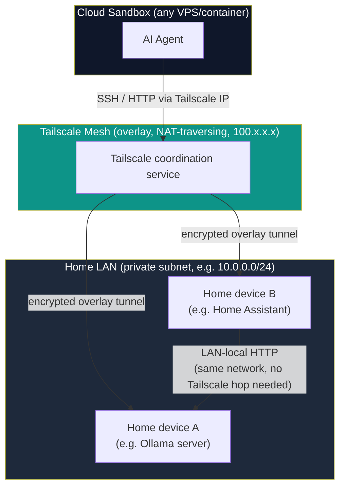
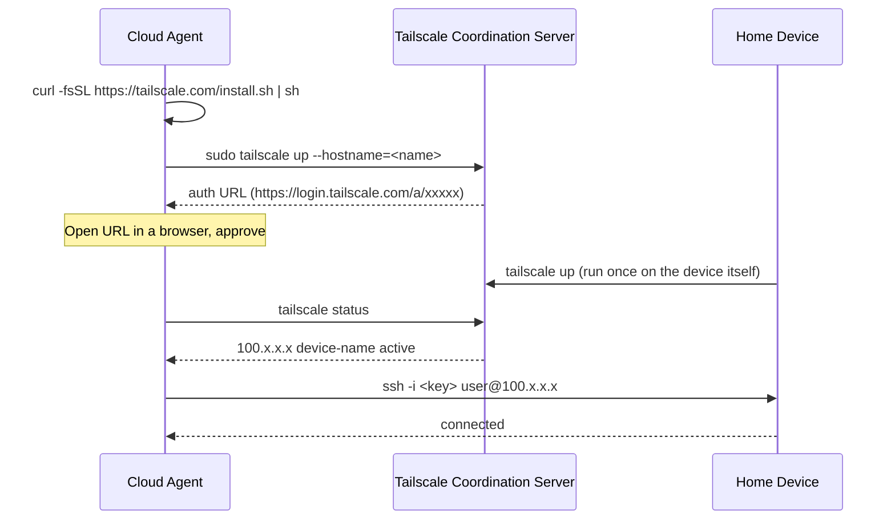
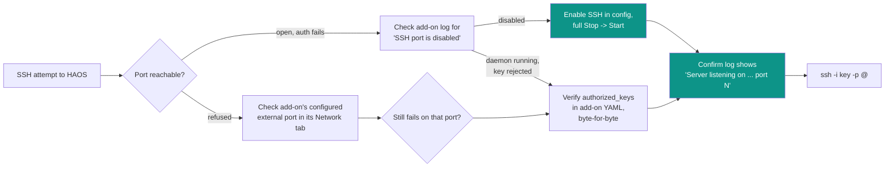
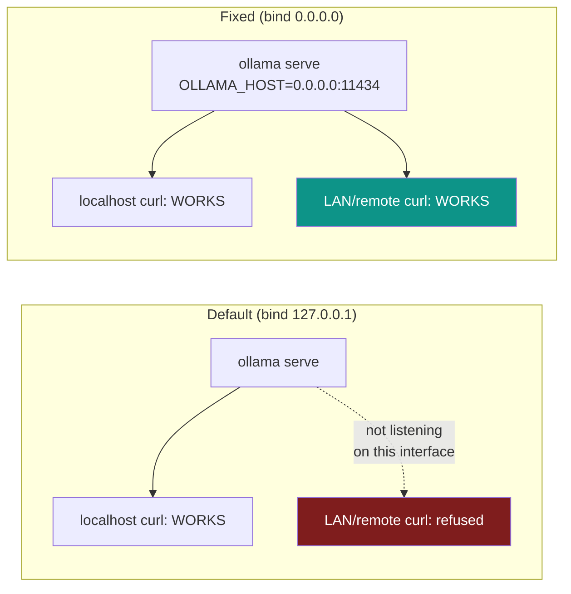
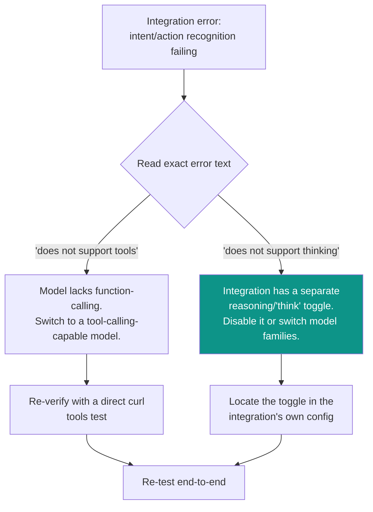

# Bridging Cloud AI Agents to Home-Network Devices (Tailscale + Ollama + Home Assistant)

## Problem

A cloud-hosted AI agent (VPS, container, cloud sandbox) cannot reach devices on a home
LAN by default. Private IPs like `192.168.x.x` or `10.0.0.x` are not routable from the
public internet — any direct connection attempt from a cloud environment to a home
device's LAN IP will fail with `No route to host` or a timeout. This is expected
network behavior, not a misconfiguration to "fix" on the home-device side.

This guide covers the general pattern for solving this — using Tailscale as a mesh
overlay network — plus the specific gotchas encountered when the home devices in
question are an **Ollama** LLM server and a **Home Assistant OS** instance, since that
combination surfaces several non-obvious configuration pitfalls beyond the basic
networking problem.

## Architecture



**Key principle:** the cloud agent always reaches home devices via their Tailscale
overlay address — never the LAN address. But two devices already on the same home LAN
can talk to each other over their plain local IPs; Tailscale solves "how does the
outside agent get in," not device-to-device communication within the LAN itself.

## Setting up the Tailscale bridge



Once both sides are authenticated to the same tailnet, `tailscale status` lists every
device with its overlay IP. Use that address for everything going forward instead of
the original LAN IP.

## Diagnosing SSH failures: network-unreachable vs. auth-rejected

A generic SSH `Permission denied` can stem from two entirely different causes that look
identical at a glance:

1. **Network unreachability** — port closed, firewalled, or device offline.
2. **Auth rejection** — port open, daemon responding, but the offered key isn't
   authorized (or the wrong username was used).

Diagnose the transport independently of SSH auth before touching any keys:

```bash
# Transport-layer check (no SSH auth involved)
tailscale ping --timeout=5s <device-hostname>
timeout 8 bash -c "cat < /dev/null > /dev/tcp/<tailscale-ip>/22" && echo OPEN || echo CLOSED
nc -zv -w 5 <tailscale-ip> 22

# If OPEN, get the exact SSH-layer rejection reason:
ssh -i <key> -o ConnectTimeout=10 -v <user>@<host> "echo ok" 2>&1 \
  | grep -iE "identity file|offering|denied|no more auth"
```

If the port check succeeds but SSH still fails, the verbose log is definitive:
`Offering public key: ... SHA256:<fingerprint>` immediately followed by
`Authentications that can continue: publickey,password` means the server saw the key
and rejected it outright — a key/username problem, not a network problem.

**Two common causes of a clean auth rejection when the key genuinely is correct:**

- **Wrong username.** SSH defaults to the *client's own local username* unless told
  otherwise. If the cloud sandbox's local account name doesn't match any account on the
  target device, every key attempt fails cleanly regardless of correctness:
  ```bash
  ssh -i <key> <tailscale-ip>                       # defaults to this machine's own username — often wrong
  ssh -i <key> <actual-remote-username>@<tailscale-ip>   # confirm the real username explicitly
  ```
- **Post-reboot transition window.** After a device reboots, `tailscale status` briefly
  shows `offline, last seen Xs ago` while networking and `tailscaled` come back up
  (roughly 30s-2min). Retrying SSH during this window looks like an auth failure but is
  really "device isn't on the tailnet yet." Wait for `active` (ideally
  `active; direct <ip>:<port>`, indicating a direct P2P path rather than a relay) before
  retrying.

## Home Assistant OS: SSH is a separate surface from a normal Linux box

HAOS does not run a plain OpenSSH daemon on port 22 by default. SSH access comes via
the "Advanced SSH & Web Terminal" **add-on**, which differs from a standard Linux SSH
setup in several ways:

- It runs **Dropbear**, not OpenSSH — identifiable by its banner:
  `SSH-2.0-dropbear_2026.91`.
- Authorized keys are configured through the **add-on's own YAML config UI**, not a
  file you edit directly over an existing SSH session the normal way.
- The add-on has its own **enable/disable toggle for the SSH daemon itself**,
  independent of whether `authorized_keys` is populated correctly. Check the add-on's
  own log for definitive state:
  ```
  WARNING: SSH port is disabled. Prevent start of SSH server.
  ```
  versus, once enabled:
  ```
  INFO: Starting the SSH daemon...
  Server listening on 0.0.0.0 port 22.
  ```
- The add-on's **external port mapping can differ from the daemon's actual bind port**.
  Rather than assuming a commonly documented default (e.g. 22222), check the add-on's
  log for the literal `Server listening on ... port N` line and connect to that port.
- Config changes to the add-on frequently require a full **Stop → Start**, not just
  "Restart" — some versions only re-read config on a genuine stop/start cycle.



### Where integration config actually lives

Home Assistant stores runtime integration state as JSON under
`/homeassistant/.storage/`, most notably `core.config_entries`. This is useful for
confirming a UI change actually persisted, or for inspecting a setting that isn't
exposed as an obvious toggle:

```bash
ls /homeassistant/.storage/ | grep -iE 'ollama|conversation|assist_pipeline|config_entries'
jq '.data.entries[] | select(.domain=="<integration_domain>")' /homeassistant/.storage/core.config_entries
```

Always back up before editing:
```bash
cp /homeassistant/.storage/core.config_entries \
   /homeassistant/.storage/core.config_entries.bak_$(date +%Y%m%d_%H%M%S)
```

Edit surgically with `jq` rather than hand-editing the (usually single-line, large)
JSON file directly:
```bash
jq -c '(.data.entries[] | select(.domain=="<domain>") | .subentries[] |
        select(.subentry_type=="<type>") | .data.<field>) = <value>' \
  /homeassistant/.storage/core.config_entries > /tmp/patched.json
cp /tmp/patched.json /homeassistant/.storage/core.config_entries
```

Storage files are read on startup, not live-watched — apply changes with a restart, and
poll for the web UI coming back rather than trusting the restart command's own session
timeout (HA Core restarts commonly take 1-3 minutes and detach from the invoking shell):
```bash
ha core restart
# poll instead of waiting on the command itself:
# timeout 8 bash -c "cat < /dev/null > /dev/tcp/<ha-ip>/8123" && echo "UI reachable"
```

## Ollama: default bind address is localhost-only

A freshly installed Ollama service binds to `127.0.0.1:11434` by default. This works
when testing directly on the same machine Ollama runs on (`curl localhost:11434`), but
is completely unreachable from any other device — including another appliance on the
same LAN — with no firewall involved; the socket simply isn't listening on any
externally-reachable interface.



Diagnose:
```bash
sudo ss -tlnp | grep 11434
# 127.0.0.1:11434   <- localhost-only
#        *:11434    <- all interfaces
```

Fix with a systemd drop-in override (survives package upgrades, cleaner than editing
the shipped unit file):
```bash
sudo mkdir -p /etc/systemd/system/ollama.service.d
sudo tee /etc/systemd/system/ollama.service.d/override.conf > /dev/null << 'EOF'
[Service]
Environment="OLLAMA_HOST=0.0.0.0:11434"
EOF
sudo systemctl daemon-reload
sudo systemctl restart ollama
```

Verify against the LAN-facing IP specifically, not `localhost`, to actually exercise
the fix:
```bash
curl -s http://<device-lan-ip>:11434/api/tags
```

## Model capability gaps: tool-calling and "thinking" are separate, model-specific features

Integrations that let a model take actions (e.g. Home Assistant's Assist voice/text
pipeline invoking HA services) rely on Ollama's `tools` parameter for function calling.
**Not every model implements this** — some (e.g. `gemma2`) reject the request outright:

```json
{"error":"registry.ollama.ai/library/gemma2:2b does not support tools"}
```

Verify tool-calling support directly against Ollama before debugging from the
integration's side:

```bash
curl -s http://localhost:11434/api/chat -d '{
  "model": "<candidate-model>",
  "messages": [{"role":"user","content":"turn on the kitchen light"}],
  "stream": false,
  "tools": [{
    "type":"function",
    "function": {
      "name":"HassTurnOn",
      "description":"Turn on a device or entity",
      "parameters": {"type":"object","properties":{"name":{"type":"string"}},"required":["name"]}
    }
  }]
}'
```

A working model returns a structured `tool_calls` block:
```json
{"message":{"tool_calls":[{"function":{"name":"HassTurnOn","arguments":{"name":"kitchen light"}}}]}}
```

Models confirmed to support tool-calling at sizes suitable for constrained edge
hardware (e.g. ~7GB RAM boards): `llama3.2:3b`, `qwen2.5:3b`. Cold-load time can vary
meaningfully between similarly-sized models on identical hardware — worth benchmarking
if first-response latency matters for the use case.

Separately, some integrations expose their own **"thinking"/reasoning-trace toggle**
(distinct from tool-calling support entirely). Only specific model families implement
Ollama's `think` feature; requesting it from an unsupported model produces a similarly
worded but functionally different error:

```
"<model>" does not support thinking (status code: 400)
```

If an integration is misbehaving after a model swap and the error text references a
*different* unsupported capability than expected, check for a second, independent
capability flag in that integration's own configuration — a model change alone does not
guarantee every feature toggle the integration exposes is compatible with the new
model.



Verify directly against Ollama the same way, adding the specific flag in question:
```bash
curl -s http://localhost:11434/api/chat -d '{
  "model": "<model>", "messages": [...], "stream": false, "think": true, "tools": [...]
}'
# {"error":"\"<model>\" does not support thinking"}  <- confirms the flag itself is the cause
```

## Summary

1. A cloud agent cannot reach a home LAN IP directly — bridge with Tailscale, and use
   the resulting overlay (`100.x.x.x`) address for everything.
2. A clean SSH `Permission denied` after a successful port/ping check is an
   **authentication** problem (wrong key, wrong username), not a network problem.
3. Home Assistant OS's SSH add-on is a distinct surface from a normal Linux SSH setup —
   separate auth config, its own enable/disable toggle, and a possibly non-default
   port.
4. Ollama defaults to binding `127.0.0.1` only — set `OLLAMA_HOST=0.0.0.0:<port>` via a
   systemd drop-in for LAN/remote reachability.
5. Verify tool-calling support directly against Ollama with `curl` before assuming an
   integration-level error is a configuration mistake.
6. Some integrations expose additional model-capability toggles (e.g. a "thinking"
   flag) that are independent of model selection and can produce a superficially
   similar but functionally different error.
